## From Developer

### Setup

1. Fork the repo
2. Clone the repo
3. Run `npm install` to install dependencies
4. Start the app: `npm run dev`
5. The app runs on [http://localhost:3000](http://localhost:3000) by default
6. Seed the database with:
   ```bash
   curl -X POST http://localhost:3000/api/seed
   ```
7. Run `npm dev` to run dev environment

### Decisions

For a detailed look at the architectural and implementation decisions I made, see [DECISIONS.md](./DECISIONS.md).

### Notes

- This repo is a fork of the original [Revenue Vessel take-home](https://github.com/Revenue-Vessel/rv-takehome).
- An `npm install` is required before `npm dev`.
- Only the default port `3000` is used even though port `3001` is mentioned.
- No Docker used — setup ran smoothly with local SQLite database.
- Assumes Node.js 18+ is installed.

### Milestone 1 (Option A: Sales Forecasting Engine)

This feature introduces an advanced analytics endpoint that calculates win rates for deals based on two key dimensions:

- **Transportation Mode** (e.g., trucking, ocean, rail, air)
- **Sales Representative**

#### Path Selection

I chose the Sales Forecasting Engine (Milestone 1, Option A) to flex my BCG experience in working with business logic and decision-making. I am also new to Next.js (I use Express.js) and wanted to prove I could work with it.

#### Endpoint

```
GET /api/stats/win-rates
```

#### Response Format

```json
{
  "byTransportationMode": {
    "ocean": {
      "wins": 1,
      "losses": 0,
      "winRate": 1
    },
    "trucking": {
      "wins": 0,
      "losses": 1,
      "winRate": 0
    }
  },
  "bySalesRep": {
    "Mike Rodriguez": {
      "wins": 1,
      "losses": 0,
      "winRate": 1
    },
    "Jennifer Walsh": {
      "wins": 0,
      "losses": 1,
      "winRate": 0
    }
  }
}
```

#### Implementation Notes

- Only deals in the `closed_won` and `closed_lost` stages are considered.
- Win rate is calculated using the formula:

  ```
  winRate = wins / (wins + losses)
  ```

- The logic lives in:
  - `src/lib/business/deals/analytics.ts`: core win rate calculation
  - `src/app/api/stats/win-rates/route.ts`: API handler

#### Testing

- Unit tests for this API are located in:  
  `src/__tests__/api/win-rates.test.ts`

- Run all tests using:

  ```bash
  npm test
  ```

- If you encounter mocking errors during testing, ensure the mock path for `AppDataSource` is correctly set to:

  ```ts
  jest.mock("../../data-source", () => ({
    AppDataSource: {
      isInitialized: true,
      getRepository: jest.fn(),
    },
  }));
  ```

#### Screenshots

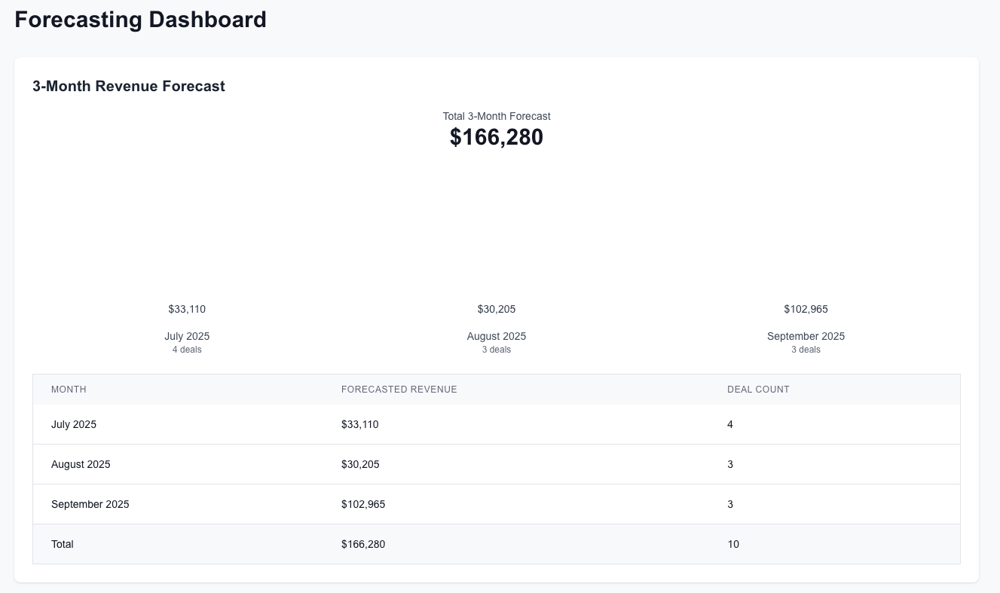
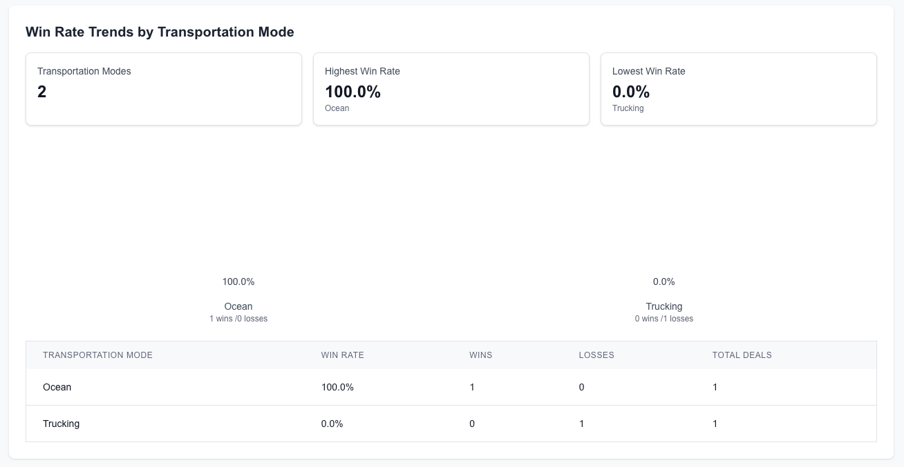
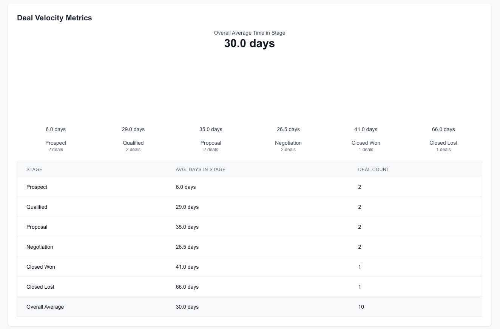
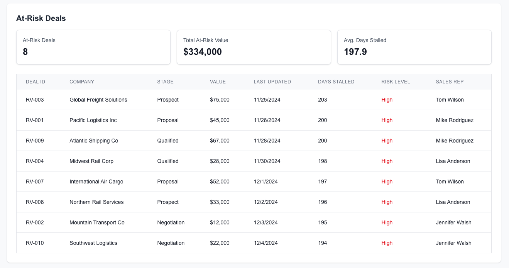
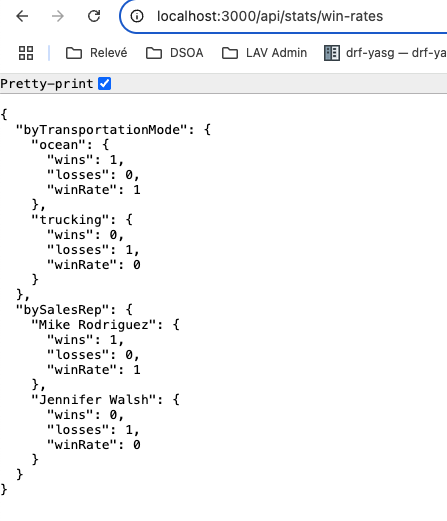

### BONUS: Milestone 1 (Option B: Territory Management System)

This feature introduces an interactive dashboard and API that groups deals into U.S. territories and evaluates performance by region and sales rep. It provides sales ops leaders with a way to track team performance by region and identify workload imbalances.

#### Path Selection

I included this to highlight my full-stack development capabilities and product thinking. The system allows for flexible territory definition and displays insights in both tabular and map-based visualizations.

#### Endpoint

```
GET /api/stats/territories
```

#### Response Format

```json
{
  "Pacific": {
    "wins": 1,
    "losses": 0,
    "winRate": 1,
    "totalValue": 95000,
    "repBreakdown": {
      "Mike Rodriguez": {
        "wins": 1,
        "losses": 0
      }
    }
  },
  "Mountain": {
    "wins": 0,
    "losses": 0,
    "winRate": 0,
    "totalValue": 0,
    "repBreakdown": {
      "Jennifer Walsh": {
        "wins": 0,
        "losses": 0
      }
    }
  },
  "Southeast": {
    "wins": 0,
    "losses": 1,
    "winRate": 0,
    "totalValue": 0,
    "repBreakdown": {
      "Tom Wilson": {
        "wins": 0,
        "losses": 0
      },
      "Jennifer Walsh": {
        "wins": 0,
        "losses": 1
      }
    }
  },
  "Midwest": {
    "wins": 0,
    "losses": 0,
    "winRate": 0,
    "totalValue": 0,
    "repBreakdown": {
      "Lisa Anderson": {
        "wins": 0,
        "losses": 0
      }
    }
  },
  "Southwest": {
    "wins": 0,
    "losses": 0,
    "winRate": 0,
    "totalValue": 0,
    "repBreakdown": {
      "Tom Wilson": {
        "wins": 0,
        "losses": 0
      }
    }
  },
  "Northeast": {
    "wins": 0,
    "losses": 0,
    "winRate": 0,
    "totalValue": 0,
    "repBreakdown": {
      "Mike Rodriguez": {
        "wins": 0,
        "losses": 0
      }
    }
  }
}
```

#### Implementation Notes

- City/state info is parsed into U.S. regions using string matching.
- Grouping by territory supports future use for reassignment or rep balance views.
- The `/territories` dashboard view includes:
  - Table view with region/rep stats
  - Comparison chart
  - Region-specific views
  - D3.js map of U.S. with dynamic region performance coloring

#### Screenshots

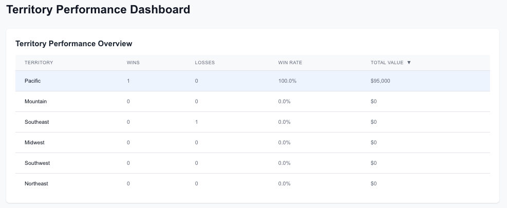
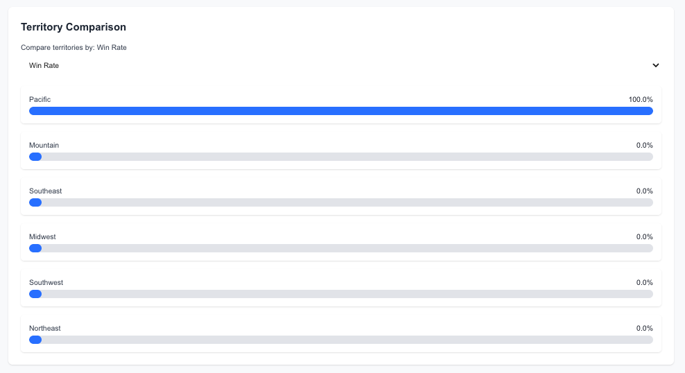
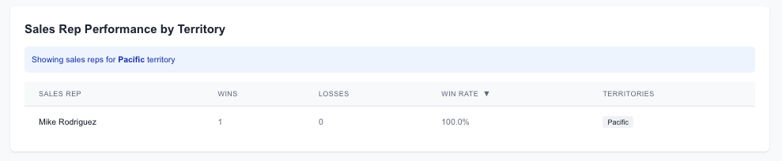
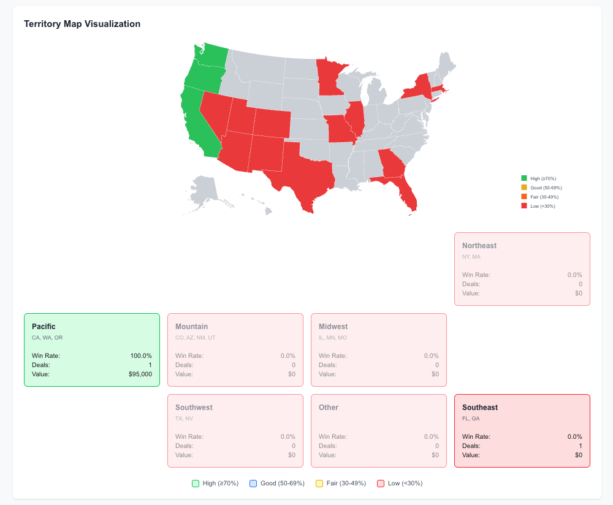
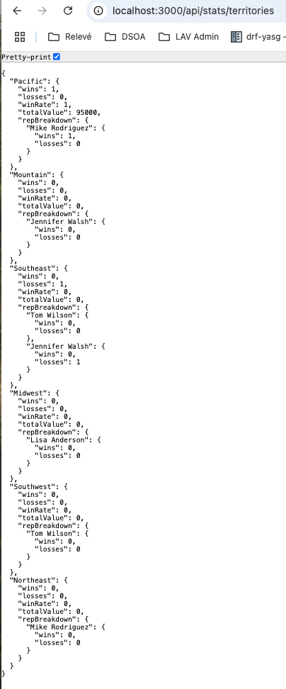

### Optional Milestone 2: Specialization Deep Dive

For the optional Milestone 2, I pursued Path B: Full-Stack Product Development to showcase product-focused engineering work. I selected two enhancements:

#### Advanced Search & Filtering

I added client-side filtering to the Territories Dashboard, allowing users to:

- Filter by **territory name**
- Filter by **sales rep**
- Filter by **stage**
- Filter by **transportation mode**
- See filtered results update immediately without page reload

This improves usability for sales and operations leaders who want to quickly zero in on a rep or region without navigating through raw JSON or cluttered tables.

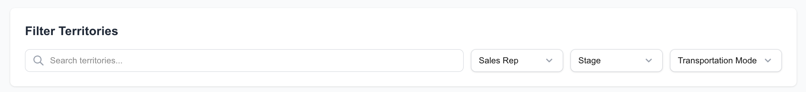

#### Mobile-Responsive Design

The application layout was adjusted for mobile and small screens using responsive Tailwind CSS utilities. Improvements include:

- Dashboards now stack vertically on narrow screens
- Tables and charts are scrollable or reformatted for readability
- Navigation and headers adjust layout for smaller viewports

This ensures the tool remains usable on phones and tablets for users on the go.
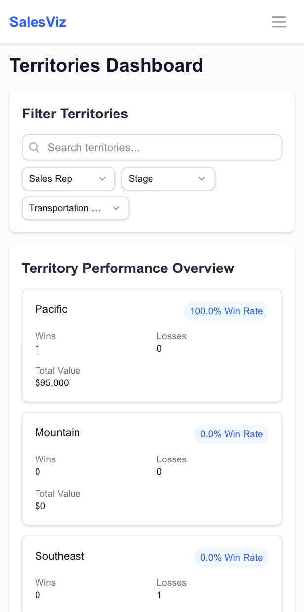

### AI Collaboration Report

For this project, I used a combination of Claude Sonnet 4 in cursor and I also used Cline with OpenRouter in VSCode as well as ChatGPT 4o for some of the prose tasks.

- **Analytics Logic Refactor**: Claude proposed a basic implementation for calculating win rates by sales rep and transportation mode. I improved this by explicitly filtering out non-final deal stages like "prospect", ensuring accurate metrics.
- **Test Coverage**: I added unit tests that covered edge cases, such as no deals present, invalid stage entries. These were beyond the inital test suggestions from AI.

Using AI as a collaborator helped me move faster, but I took care to always review and elevate the generated code to meet production standards.

Manually, I addressed some of the linting and "Problems" that were being reported.

### Technical Decisions

- **Entity Grouping**: I focused on grouping by `transportation_mode` and `sales_rep` for the win rate calculations, as these are the most actionable and consistently available fields.
- **Territories and Reassignment**: Since the system doesn’t yet support territory definitions or reassignment workflows, I treated sales rep names as primary identifiers for performance comparison.
- **Tech Stack Respect**: I did not introduce Docker or external frameworks to avoid interfering with the provided repo setup. I ensured compatibility with the SQLite database and existing TypeORM structure. I tend to favor microservices but am fine not using containers if that is the working norm.

## Demo Guide

To explore the implemented features and dashboards:

1. Start the development server with:
   ```bash
   npm install
   npm run dev
   ```
2. Open your browser to http://localhost:3000.
   You’ll land on the home page, which now includes navigation links to:

- Win Rate Analytics
- Forecasting Dashboard
- Territory Management Dashboard

3. Click any link to explore the dashboards. Each dashboard provides a unique view:

- Win Rate Analytics: API-driven JSON view of win rates by transportation mode and sales rep
- Forecasting Dashboard: Visual charts showing 3-month revenue forecast, win rate trends, deal velocity, and at-risk deals
- Territory Management Dashboard: Interactive table and visual map with filters, rep assignments, and performance by region

### What I'd prioritize next with more time

- Add more advanced filtering, such as multi-select transportation modes or custom date ranges.
- Enhance the territory map with richer interactivity — e.g., drilldowns by region, hover tooltips with stats, or click-to-filter.
- Implement deal reassignment workflows to fully support territory rep balancing with audit logging.
- Expand the forecasting logic to support user-adjustable probability weights and trend-based adjustments.
- Detect and flag stalled deals automatically with email or in-app notifications.
- Strengthen test coverage with integration tests, UI tests, and edge case QA automation.
- Add role-based access control (RBAC) to secure sensitive data and restrict access by role.
- Sanitize inputs and improve data validation to guard against bad or malicious data.
- Optimize backend performance with query caching or pagination where needed.
- Consider adding a light onboarding or tooltip experience to help sales leaders navigate the dashboards quickly.

### Test coverage

- Should calculate win rates correctly.
- Should handle errors correctly.
- Should return empty results if no deals exist.
- Should ignore deals that are not closed_won or closed_lost.
- Should gracefully skip deals with invalid stage values.

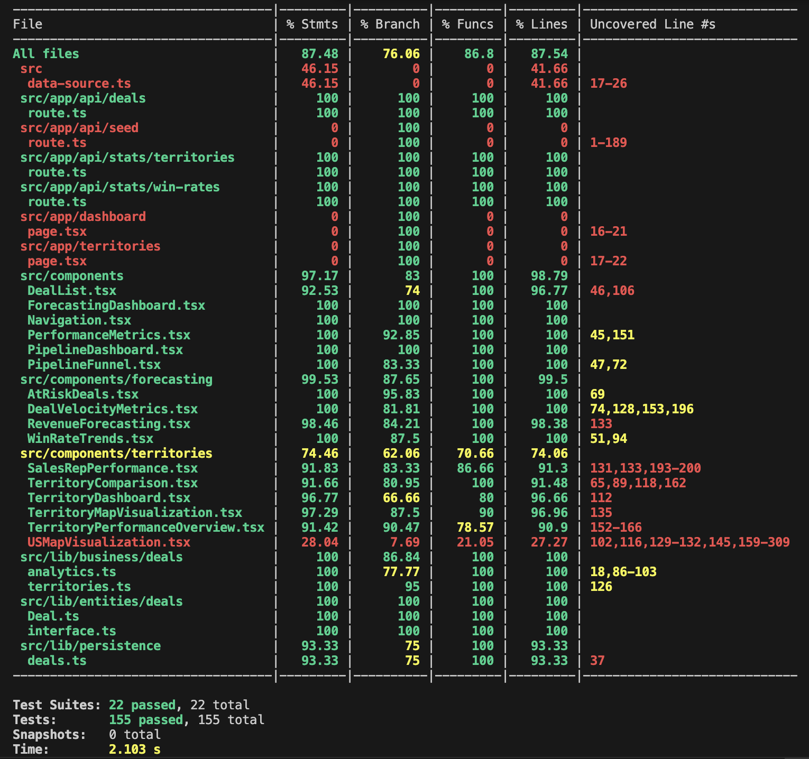

### Demo: Win Rates Endpoint

Here's a screenshot showing the `/api/stats/win-rates` endpoint response:


## Forecasting Dashboard

This dashboard was added to fulfill the visual reporting requirement for Milestone 1. It provides clear summaries of sales pipeline insights for sales leaders who prefer visual dashboards over APIs.

### 1. 3-Month Revenue Forecast

Displays a forecast based on expected close dates and weighted deal values.


### 2. Win Rate Trends by Transportation Mode

Provides win/loss breakdown by mode such as trucking and ocean.


### 3. Deal Velocity Metrics

Calculates and presents average time spent in each deal stage.


### 4. At-Risk Deals

Highlights deals with no stage movement in 21+ days.


